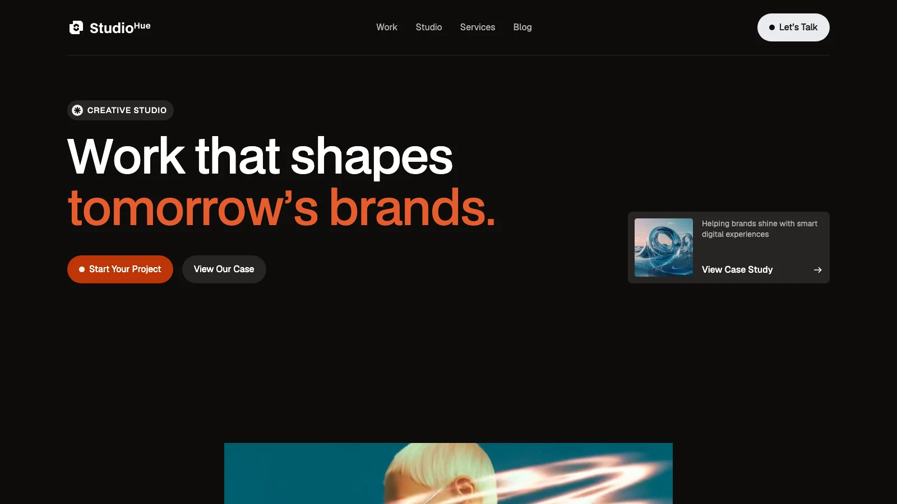

# StudioHue – Agency Astro Theme

A bold, dark creative-agency theme for [Astro](https://astro.build) 7 with three CMS-driven
collections – **Services**, **Projects** (case studies) and **Blog** – that can be edited in
[Strapi](https://strapi.io) (including the Strapi MCP server for AI agents) or kept as plain JSON.



## Features

- 12 page designs: Home, Work, Studio (About), Services, Blog, Contact, Style Guide, 404, Password
  page, plus Project / Service / Post detail templates
- Scroll & hover interactions, smooth scrolling (Lenis), GSAP number counters, sliders, tabs and FAQ
  accordions – all ported 1:1 from the original design
- Content collections (Astro content layer) for Services, Projects and Blog posts
  - **Strapi first**: set `STRAPI_URL` and the site is built from your Strapi content
  - **JSON fallback**: without Strapi the bundled `src/data/*.json` is used – the theme always builds
- Site settings, navigation and footer menus in two JSON files (`src/config/`)
- SEO component with Open Graph / Twitter tags and per-page descriptions
- Fully static output – deploy anywhere (Netlify, Vercel, Cloudflare Pages, GitHub Pages, …)

## Tech stack

| Layer      | Tool                                                                    |
| ---------- | ----------------------------------------------------------------------- |
| Framework  | Astro 7 (static)                                                        |
| Content    | Astro content collections + custom Strapi loader, JSON fallback         |
| CMS        | Strapi 5 (`../Strapi`, optional) with MCP server enabled                |
| Styling    | Design-system CSS (custom properties) – `src/styles/`                   |
| Motion     | GSAP 3 (+ SplitText, ScrollTrigger), Lenis, Webflow interactions runtime|
| Fonts      | BDO Grotesk (self-hosted), Geist + Instrument Serif (Google Fonts)      |

## Quick start

```sh
npm install
npm run dev        # http://localhost:4321
npm run build      # static output in dist/
npm run preview
```

Requires Node ≥ 22.12.

## Project structure

```
src/
├── config/
│   ├── config.json        # site title, SEO defaults, contact info, CTA & footer text, Strapi ids
│   └── menu.json          # main nav, footer columns, footer bottom links, social links
├── layouts/Base.astro     # <html> shell: SEO, fonts, styles, script stack
├── components/            # Header, Footer, Cta, cards, buttons, badges …
├── pages/                 # one file per route (+ [slug] templates for the collections)
├── content.config.ts      # collection schemas (services / projects / blog)
├── loaders/strapi.ts      # content-layer loader: Strapi → fallback JSON
├── lib/                   # strapi client, content helpers, Webflow page ids
├── data/                  # bundled demo content (services.json, projects.json, blog.json)
├── styles/                # normalize.css, webflow.css, studiohue.webflow.css, theme.css
└── fonts/                 # BDO Grotesk
public/
├── images/  videos/       # design assets (public/images/cms/ = collection images)
└── js/                    # runtime: jquery, webflow.js, gsap, SplitText, ScrollTrigger, lenis, site.js
scripts/csv-to-json.mjs    # converts a Webflow CMS CSV export into src/data/*.json
.claude/skills/            # agent handbook (SKILL.md + references/) for this template
```

## Configuration

- **`src/config/config.json`** – site name & base URL, favicons, default meta title/description/image,
  contact e-mails / phone / address (used by the CTA block and contact page), CTA copy, footer copy
  and the Strapi collection ids.
- **`src/config/menu.json`** – navigation links, the nav button, the four footer columns, the footer
  bottom links and the social links shown on the contact page.

Pages read these files at build time, so a change is reflected everywhere.

## Content

### Collections

| Collection | Route                | Used on                                             |
| ---------- | -------------------- | --------------------------------------------------- |
| services   | `/services/<slug>`   | Home (tabs + mobile slider), `/service`, detail page |
| projects   | `/project/<slug>`    | Home slider, `/work`, detail page, "Similar work"    |
| blog       | `/post/<slug>`       | Home "Latest thinking", `/blog`, post detail         |

Ordering: services by `number`, projects by `serial`, posts by `order` (newest first). The post with
`featured: true` is the large card on `/blog` and is excluded from the lists.

### Option A – JSON (default)

Edit `src/data/services.json`, `projects.json` and `blog.json`. Rich-text fields hold HTML
(`<h4>`, `<p>`, `<ul>`, `<figure>` …) exactly as the design expects. Put images in
`public/images/cms/` and reference them as `/images/cms/<file>`.

If you have a Webflow CMS CSV export, drop the three CSV files in `../CMS` and run
`npm run data:csv` to regenerate the JSON.

### Option B – Strapi

1. Start the Strapi project in `../Strapi` (`npm install && npm run develop`). On first start it
   creates the three content types, seeds them with the demo content (images included) and grants
   the Public role read access. See `../Strapi/README.md`.
2. Copy `.env.example` to `.env` and set `STRAPI_URL=http://localhost:1337`
   (add `STRAPI_TOKEN` if you prefer a read-only API token over public permissions).
3. `npm run build` – the build log shows `services: 6 entries from Strapi`.

If Strapi is unreachable the loader logs a warning and falls back to the JSON files, so preview
deployments keep working. Rich-text fields accept the HTML imported from Webflow **or** Markdown
written in the Strapi editor.

## Customising the design

All colours, type scales and spacing are CSS custom properties defined in
`src/styles/studiohue.webflow.css`. Override them in `src/styles/theme.css`:

```css
:root {
  --color--primitive--brand--500: #be3508; /* primary accent */
}
```

The `/style-guide` page lists the colours, type styles and button variants.

## Interactions runtime

The design's animations run on `public/js/webflow.js` (Webflow's exported interactions engine).
Each page passes its `page` key to `<Base>` so the runtime applies the right set of interactions –
see `src/lib/webflow-pages.ts`. When you add a page, reuse the key of the page it was cloned from.
`public/js/site.js` holds the theme's own code (Lenis smooth scroll + counters).

## Deployment

`npm run build` outputs a static site to `dist/`. Set `site.base_url` in `config.json` to your domain
so Open Graph URLs are absolute. Any static host works; for a Strapi-backed site, rebuild on content
changes (e.g. a Strapi webhook triggering your host's build hook).

## Credits & licences

- Theme code: MIT.
- BDO Grotesk (`src/fonts/`) is included as shipped with the original design – check the font's
  licence for commercial use, or swap it in `src/styles/studiohue.webflow.css`.
- Demo photography is placeholder content for the demo only.
- GSAP, Lenis and jQuery are distributed under their own licences.
